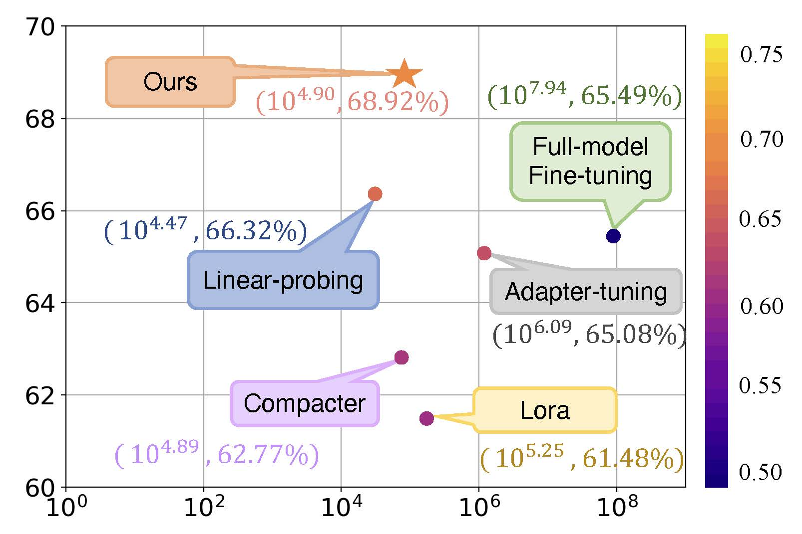

# Parameter-efficient Model Adaptation for Vision Transformers

This repo contains the official implementation for our AAAI 2023 paper <a href="https://arxiv.org/abs/2203.16329"> Parameter-efficient Model Adaptation for Vision Transformers

    
## Introduction

<p align="center">

</p>
    
In computer vision, it has achieved great transfer learning performance via adapting large-scale pretrained vision models (e.g., vision transformers) to downstream tasks. Common approaches for model adaptation either update all model parameters or leverage linear probes. In this work, we aim to study parameter-efficient model adaptation strategies for vision transformers on the image classification task. We build a benchmark and compare our method with a diverse set of baseline model adaptation methods (including state-of-the-art methods for pretrained language models). The figure above shows tradeoff between accuracy and parameter numbers of various model adaptation methods. The results are measured using the vision transformer
(ViT-B-224/32) via CLIP pretraining across the average of 20 image classification datasets. Our method places in the topleft corner and achieves the best tradeoff between accuracy and parameter efficiency. The color of points and numbers denote the performance-efficiency (PE) metric (higher is better). Our proposed Kronecker Adaptation (KAdaptation) is the **SOTA** of the [Parameter-Efficiency track](https://eval.ai/web/challenges/challenge-page/1832/leaderboard/4303) with both ViT-B/32 and ViT-B/16 at [Image Classification in the Wild (ICinW) Challenge](https://computer-vision-in-the-wild.github.io/eccv-2022/) on the ECCV2022 workshop.


## Installation
This code is built heavily on top of the benchmark toolkit [Elevater_Toolkit_IC](https://github.com/Computer-Vision-in-the-Wild/Elevater_Toolkit_IC), so you need to install the `elevater` environment first. 
To install the toolbox, you need to follow the instructions described in the original codebase [here](https://github.com/Computer-Vision-in-the-Wild/Elevater_Toolkit_IC) to install `elevater` as well as PyTorch. (Note that we found out that for this toolkit, different versions of cuda and GPU may lead to slightly different results. Our results are obtained on CUDA 11.4 and NVIDIA A6000 GPU). Then run the following command to install our dependecies:

```Shell
pip install -r requirements.txt
```

## Datasets
The datasets will be automatically downloaded and prepared the first time you calling the toolit. The toolkits supports the downstream evaluation of image classification on 20 datasets: `Caltech101`, `CIFAR10`, `CIFAR100`, `Country211`, `DTD`, `EuroSat`, `FER2013`, `FGVCAircraft`, `Food101`, `GTSRB`, `HatefulMemes`, `KittiDistance`, `MNIST`, `Flowers102`, `OxfordPets`, `PatchCamelyon`, `SST2`, `RESISC45`, `StanfordCars`, `VOC2007`.


## Launch experiments and reproduce the results

Before running any code you must activate the conda environment:

    source activate env_name

or, if you're on Windows:

    activate env_name

This will enable the environment for your current terminal session. 
    
#### Running arguments: 
 We provide example scripts in scripts where you can specify different configurations from command line directly without modifying the shell script. You can launch experiments across all dataset by passing the given arguments
    
KAdaptation    
```Shell
cd scripts
bash kadapter_clip.sh
```

Adapter-tuning
```Shell
cd scripts
bash adapter_clip.sh
```

LoRA
```Shell
cd scripts
bash lora_clip.sh
```

Compacter
```Shell
cd scripts
bash compacter_clip.sh
```

Fine-tuning  
```Shell
cd scripts
bash run_finetune.sh
```

Linear-probing   
```Shell
cd scripts
bash run.sh
```

#### Reading results
Using the provided [read_txt.py](read_txt.py) to read the final txt results in the predictions folder for each individual dataset and seed. 

Or [read_results.py](read_results.py) to read the log files for each individual dataset and seed.

You can get averaged results of ACC/Trainable # para for our KAdaptation: 68.92/79,699.
Adapter-tuning: 65.08/1,237,587.
LoRA: 61.48/176,979.
Compacter: 62.79/77,907.
Fine-tuning: 65.49/87,878,739.
Linear-probing: 66.32/29,523.


## Code structure
```
Main/
├── vision_benchmark
│   ├── commands （contains main files for running different methods)
│   │   ├── adapter_clip.py (Adapter-tuning)
│   │   ├── prepare_submit.py (Wrap-up results for submission to the benchmark)
│   │   ├── ...
|   ├── evaluation （contains training files and model files for different methods)
│   │   ├── adapter_tuning_clip.py  (Adapter-tuning training file)
│   │   ├── adapter_model.py (Adapter-tuning model file)
│   │   ├── kadaptation_clip.py (KAdaptation training file)
│   │   ├── model.py (KAdaptation model file)
│   │   ├── ...
│   ├── ...
├── ...
```


## Acknowledgements
We thank the authors of [ELEVATER](https://arxiv.org/abs/2204.08790) for providing the useful toolkits. 


## Citation

Please considering citing our paper as below if you find it useful. Thank you!

```bibtex
@article{he2022parameter,
  title={Parameter-efficient Model Adaptation for Vision Transformers},
  author={He, Xuehai and Li, Chunyuan and Zhang, Pengchuan and Yang, Jianwei and Wang, Xin Eric},
  journal={arXiv preprint arXiv:2203.16329},
  year={2022}
}
```
